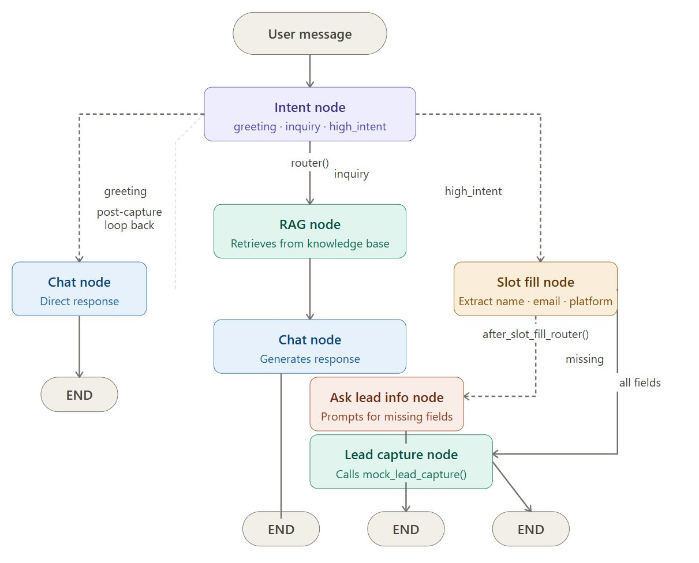

# 🎬 Inflx — Social-to-Lead Agentic Workflow

**Built for ServiceHive · AutoStream Demo Agent**  
*Converts social media conversations into qualified leads using a stateful LangGraph agent.*

🔗 **GitHub:** [github.com/IshanNaikele/Social-to-Lead-Agentic-Workflow](https://github.com/IshanNaikele/Social-to-Lead-Agentic-Workflow)

---

## 🚀 Getting Started

### Prerequisites

- Python 3.9+
- A Google AI Studio API key ([get one here](https://aistudio.google.com/))
- A Hugging Face account token ([get one here](https://huggingface.co/settings/tokens))

### 1. Clone the repo

```bash
git clone https://github.com/IshanNaikele/Social-to-Lead-Agentic-Workflow.git
cd Social-to-Lead-Agentic-Workflow
```

### 2. Create and activate a virtual environment

```bash
# Windows
python -m venv my_env
my_env\Scripts\activate

# Mac/Linux
python -m venv my_env
source my_env/bin/activate
```

### 3. Install dependencies

```bash
pip install -r requirements.txt
```

### 4. Set up environment variables

Create a `.env` file in the root directory:

```env
GOOGLE_API_KEY=your_google_api_key_here
HF_TOKEN=your_huggingface_token_here
```

> ⚠️ Never commit your `.env` file. Make sure `.env` is listed in `.gitignore`.

### 5. Run the backend (FastAPI)

```bash
uvicorn backend.main:app --reload --port 8000
```

### 6. Run the frontend (Streamlit) — open a new terminal

```bash
streamlit run frontend/app.py
```

Open your browser at `http://localhost:8501`.

---

## 🏗️ Architecture

### Why LangGraph?

LangGraph was chosen over AutoGen because this workflow is fundamentally a **stateful, single-agent pipeline** — not a multi-agent debate. LangGraph's `StateGraph` lets us define explicit nodes (intent classification, RAG retrieval, slot filling, lead capture) and route between them based on the agent's current state. This makes the logic transparent, testable, and easy to extend. The `MemorySaver` checkpointer persists the full conversation state across turns using a `thread_id`, which maps 1:1 to a user session.

### State Management

Every conversation turn flows through the `AgentState` TypedDict, which carries: the full message history, detected intent, collected lead fields (name, email, platform), a `lead_captured` flag, and the current RAG context. The graph is compiled with `MemorySaver`, so state is automatically restored on every request using the session's `thread_id`. This means even if a user provides their name in turn 2 and their email in turn 4, both are available when the tool fires in turn 5.

### Project Structure

```
Social-to-Lead-Agentic-Workflow/
│
├── agent/
│   ├── graph.py          # LangGraph StateGraph definition & routing logic
│   ├── nodes.py          # All agent nodes (intent, RAG, chat, slot fill, capture)
│   ├── state.py          # AgentState TypedDict
│   └── tools.py          # mock_lead_capture tool
│
├── backend/
│   └── main.py           # FastAPI server + WhatsApp webhook stubs
│
├── frontend/
│   └── app.py            # Streamlit UI with live agent state panel
│
├── knowledge_base/
│   └── autostream_kb.md  # RAG knowledge base (pricing, features, policies)
│
├── .env                  # API keys (not committed)
├── .gitignore
├── requirements.txt
└── README.md
```

---

## 🔄 Agent Flow



**Routing logic in plain English:**

- If `lead_captured` is already `True` → route to RAG + Chat (post-signup questions answered normally)
- If all 3 lead fields are already in state → skip straight to `lead_capture`
- If any lead fields exist (partial collection) → go to `slot_fill`
- If intent is `high_intent` and no fields yet → go to `slot_fill`
- If intent is `inquiry` → go to `RAG → Chat`
- Otherwise → go to `Chat` directly

---

## 💬 Example Conversations

### Example 1 — Pricing inquiry + sign up with multiple platforms

```
👤  I want the Pro plan, my name is Ishan and I use YouTube, Instagram, TikTok.

🎬  Almost there! Just one more thing — could you share your email address?

👤  ishan@example.com

🎬  🎉 You're officially in, Ishan!
    📧 We'll reach out to ishan@example.com within 24 hours.
    🎬 Can't wait to see your YouTube content shine with AutoStream Pro!
    Feel free to ask me anything else about AutoStream 🚀

# Terminal:
✅ Lead captured successfully: Ishan, ishan@example.com, YouTube
```

> The agent picked YouTube as the primary platform when multiple were given, collected the missing email in the next turn, then fired `mock_lead_capture()` immediately.

---

### Example 2 — Email correction mid-flow

```
👤  I want to sign up. My name is Ishan and my email is ishan@old.com.

🎬  Almost there! Just one more thing — could you share your main creator
    platform (YouTube, Instagram, TikTok, etc.)?

👤  Wait, actually use my work email: ishan@work.com. I'm a YouTube creator.

🎬  🎉 You're officially in, Ishan!
    📧 We'll reach out to ishan@work.com within 24 hours.
    🎬 Can't wait to see your YouTube content shine with AutoStream Pro!
    Feel free to ask me anything else about AutoStream 🚀

# Terminal:
✅ Lead captured successfully: Ishan, ishan@work.com, YouTube
```

> The agent detected the correction ("actually use my work email") and replaced the old value before calling the tool — `ishan@old.com` was discarded.

---

### Example 3 — Off-topic deflection + policy question after sign-up

```
👤  Hi, what is the Pro plan?

🎬  The Pro Plan for AutoStream is $79/month and includes:
    Unlimited videos, 4K resolution, AI captions, and 24/7 support.

👤  Okay, but first, can you write me a 500-word essay on patience?

🎬  I appreciate you asking, but my specialty is helping content creators
    discover how AutoStream can transform their video editing!
    I can't write essays, but I can tell you all about how our AI helps
    you edit videos faster and more efficiently.
    What kind of videos do you create?

👤  That sounds perfect, I want to sign up for my Instagram.

🎬  Awesome, let's get you onboarded to AutoStream Pro! 🎬
    I just need a few quick details:
    • your full name
    • your email address
    Feel free to share them all in one message!

👤  My name is Ishan, ishan@example.com.

🎬  🎉 You're officially in, Ishan!
    📧 We'll reach out to ishan@example.com within 24 hours.
    🎬 Can't wait to see your Instagram content shine with AutoStream Pro! 🚀

# Terminal:
✅ Lead captured successfully: Ishan, ishan@example.com, Instagram

👤  Can I get a refund?

🎬  Our policy states that there are no refunds after 7 days.
```

> Off-topic request was deflected cleanly. After sign-up, the agent answered product questions without prompting for sign-up again.

---

## 💬 WhatsApp Deployment via Webhooks

To integrate this agent with WhatsApp using the **Meta Cloud API**:

**1. Expose your FastAPI server publicly**  
Use [ngrok](https://ngrok.com/) or deploy to a cloud provider (Railway, Render, etc.) to get a public HTTPS URL.

```bash
ngrok http 8000
```

**2. Register the webhook with Meta**  
In the [Meta Developer Console](https://developers.facebook.com/), create a WhatsApp Business app and set:
- Webhook URL: `https://your-public-url.ngrok.io/webhook`
- Verify token: matches `YOUR_VERIFY_TOKEN` in `main.py`
- Subscribe to the `messages` field

**3. How it works**  
When a user messages your WhatsApp number, Meta sends a POST request to `/webhook`. The handler in `main.py` extracts the sender's phone number and message text, invokes the LangGraph agent using the phone number as the `thread_id` (which persists memory per user), and returns the agent's reply.

```python
# Phone number = unique session ID per user
config = {"configurable": {"thread_id": phone}}
result = graph.invoke({"messages": [HumanMessage(content=text)]}, config=config)
```

**4. Send the reply back**  
After getting the agent's response, use the Meta Messages API to send it back:

```python
import httpx

httpx.post(
    f"https://graph.facebook.com/v18.0/{PHONE_NUMBER_ID}/messages",
    headers={"Authorization": f"Bearer {WHATSAPP_TOKEN}"},
    json={
        "messaging_product": "whatsapp",
        "to": phone,
        "type": "text",
        "text": {"body": reply}
    }
)
```

The lead capture tool fires automatically when all 3 fields are collected — no changes to the agent logic are needed for WhatsApp deployment.

---

## 📝 Model Note

Gemini 1.5 Flash is no longer available in Google AI Studio as of 2025. This project uses **Gemini 2.5 Flash** (`gemini-2.5-flash`) as a direct replacement. It is faster, more capable, and fully compatible with the same `langchain-google-genai` integration. All agent behavior and outputs shown in this README were produced using Gemini 2.5 Flash.

---

## 👤 Author

**Ishan Naikele**  
[ishannaikele23@gmail.com](mailto:ishannaikele23@gmail.com)  
[github.com/IshanNaikele](https://github.com/IshanNaikele)
